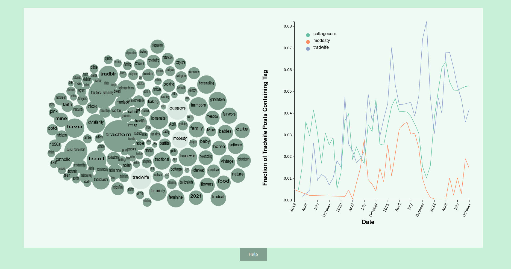

# From Flowers to Fascism: The Cottagecore to Tradwife Pipeline on Tumblr
## Oliver Allen

Social media sites can offer a breadth of perspectives and information, as well as a place for users to share their views with others. However, this can lead to the internet being used as a tool to foster extremism and radicalization. The internet environment may contribute to solidarity and radical action. In their paper Queer Fragmentation and Trans Urban Aesthetics: From Cyberpunk to Cottagecore, Barbeau et al. theorize about a potential pipeline for online extremism called the “Cottagecore to Tradwife” pipeline. In this work we show the existence of this pipeline and provide users with the ability to explore other topics and potential pipelines to Tradwife views on Tumblr. 

